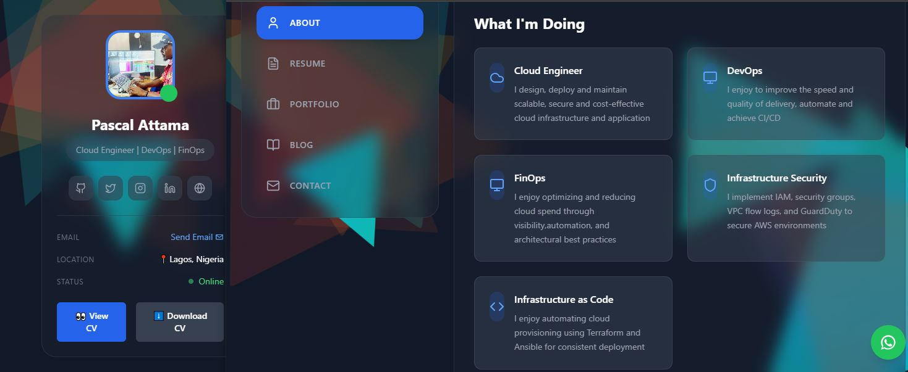
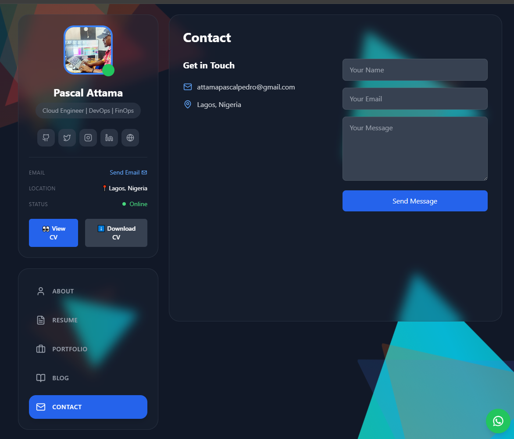
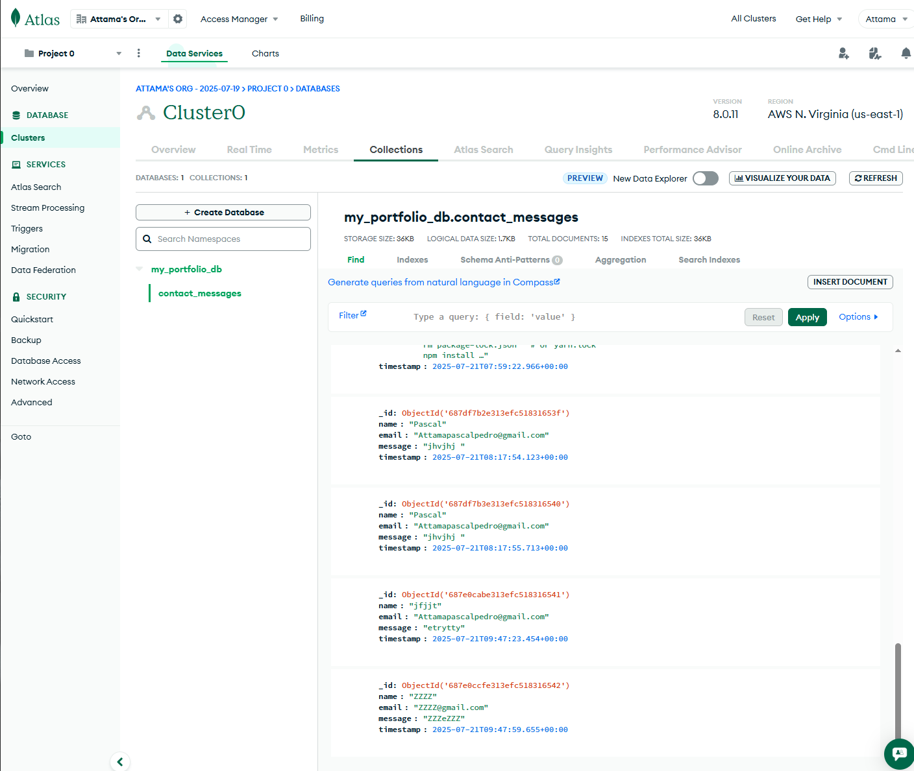
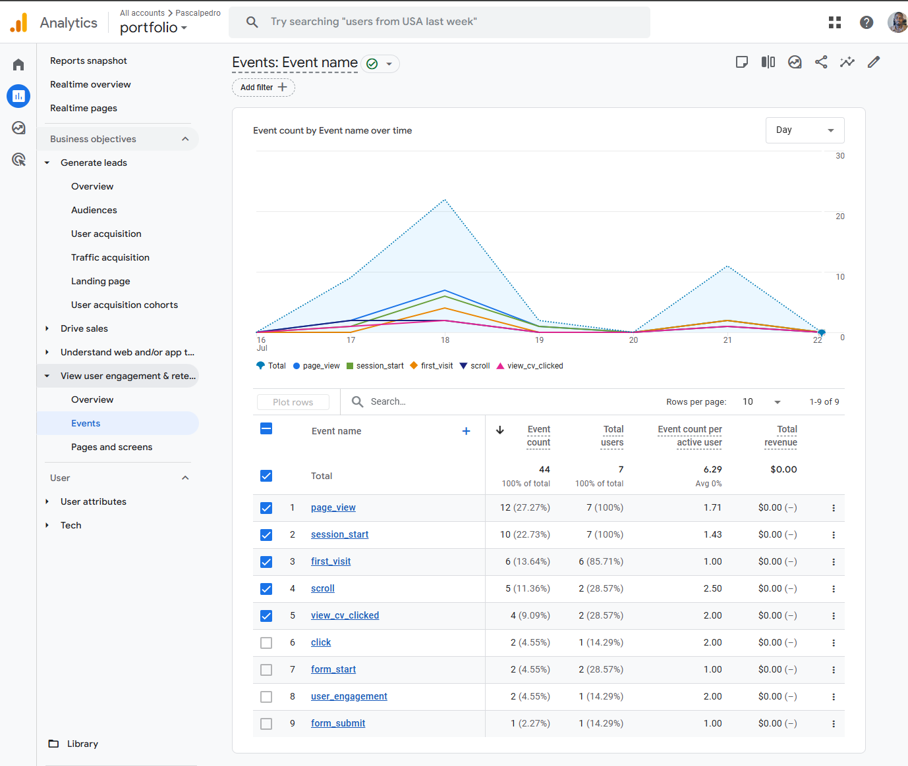
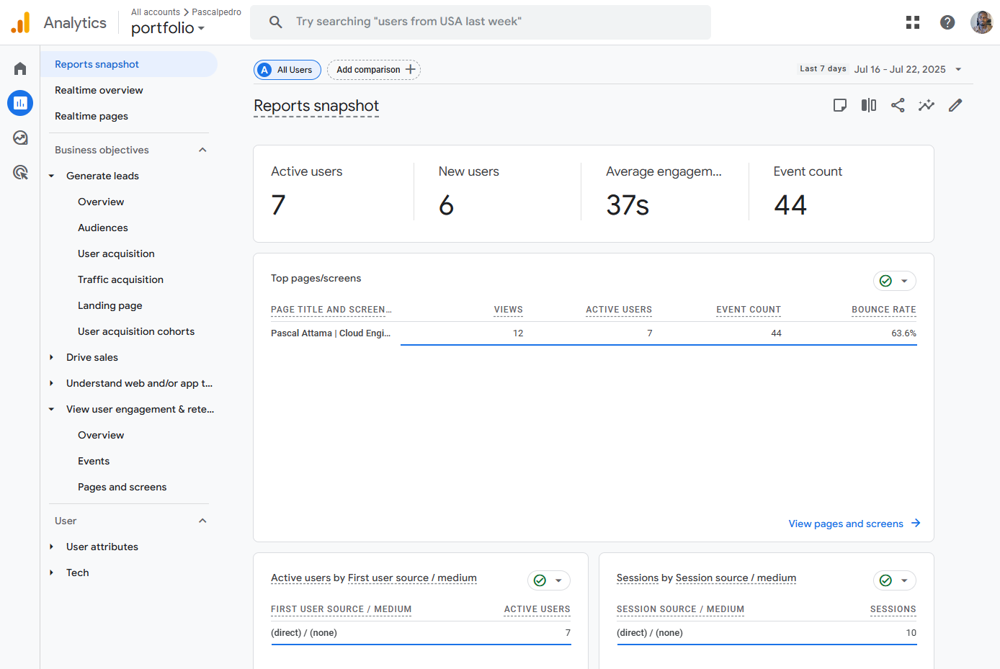

# 🌐 Pascal Attama's Full-Stack Portfolio


A professional portfolio web app built with a modern full-stack architecture:
- **Frontend**: React + TailwindCSS + Framer Motion
- **Backend**: FastAPI (Python) + Motor (MongoDB async driver)
- **Database**: MongoDB Atlas
- **Deployment**: Netlify (Frontend) + Railway (Backend)

 showcasing projects, certifications, and professional experience. This portfolio also integrates Google Drive-hosted CV viewing and downloading, along with real-time click analytics via Google Analytics 4 (GA4).



Live Demo: [My-Portfolio](https://pascalattama.netlify.app/)
---

## 📌 Features

### 🔹 Frontend (React + TailwindCSS)
- ⚡ Responsive, dark-themed UI with TailwindCSS
- ⚡Animated transitions via Framer Motion
- 🎖️ Project filtering by category (Certifications, Projects, Badges)
- 🎖️ Modal popups for badges and projects
- 📄 View and Download CV buttons (Google Drive integrated)
- 🔸 Toast notifications
- 📊 Google Analytics 4 tracking (CV clicks, page views)
- 🌐 Deployed to Netlify and Railway (CI/CD-ready)


### 🔹 Backend (FastAPI)
- RESTful API for portfolio data (CV, certs, badges)
- Contact form POST handler (optional email alert support via SMTP)
- MongoDB integration using Motor (Async driver)
- CORS configured for frontend communication

### 🔹 Database (MongoDB)
- Stores contact form submissions (`status_checks` collection)
- Easily extensible for storing project/cert data dynamically

---

## 🗂️ Project Structure
```bash
my-portfolio-websites
│
│── frontend #React app
│ ├── build/
│ │── public/ # Logos, images, etc.
│ │   ├── index.html
│ │   ├── logo.png
│ │   └── ...
│ │── .env # REACT_APP_API_URL
│ │── src/
│    │── App.css
│    │── App.js
│    │── components.js # All page components
│    ├── index.css
│    ├── index.js
│    ├── Modal.js # Custom modal popup
│ ├── package.json
│ ├── craco.config.js
│ ├── netlify.toml
│ ├── Dockerfile #Frontend Dockerfile
│ └── ...
├── backend #FastAPI backend
│ ├── server.py # Main FastAPI app
│ ├── email_utils.py  # Optional: contact email handler
│ │── .env # MongoDB URI, etc.
│ ├── venv/ #Virtual Env
│ ├── Dockerfile  # Backend Dockerfile
│ └── requirements.txt # Python dependencies
│── nginx.conf
├── .gitignore
├── render.yaml
│── docker-compose.yml
└──  README.md
```

---
## 🚀 Getting Started
✅ Prerequisites
- Node.js 18+
- Python 3.10+
- MongoDB Atlas (free tier or local MongoDB)
- Railway (or Docker optional)

### 1. Clone the Repository

```bash
git clone https://github.com/Pascalpedro/my-portfolio-website.git
cd my-portfolio-website
```

### 2. 🔧 Backend Setup (FastAPI)
🧪 Requirements
- Python 3.10+
- MongoDB Atlas (free tier or local MongoDB)
- Virtualenv (recommended)

🔌 Installation
```bash
cd backend
python -m venv venv
source venv/bin/activate   # or venv\Scripts\activate on Windows
pip install -r requirements.txt
```
🔐 Create .env in backend/:
```env
MONGO_URL=mongodb+srv://<username>:<password>@<cluster>.mongodb.net/?retryWrites=true&w=majority
DB_NAME=portfolio_db
```
▶️ Run Backend
```bash
uvicorn server:app --reload --port 8000
```
- Backend will be available at: http://localhost:8000/api

### 3. 🖼️ Frontend Setup (React + Netlify)
```bash
cd frontend
npm install
```
Create .env in frontend/:
```env
REACT_APP_API_URL=http://localhost:8000/api
REACT_APP_GA_MEASUREMENT_ID=G-XXXXXXXXXX  # Replace with your GA4 ID
```
▶️ Run Frontend
```bash
npm start
```
- Frontend runs on: http://localhost:3000

### 4. 🌍 Deployment
**Could be any of:**
```
- Frontend: Vercel, Netlify, or S3 + CloudFront
- Backend: Render, Railway, or AWS EC2
- Database: MongoDB Atlas (Cloud)
```

🧪 Netlify (Frontend)

1. Push frontend/ to GitHub
2. Go to https://netlify.com
3. Create new site from Git repo
4. Set build command:
```arduino
npm run build
```
- and publish directory:
```nginx
dist or build
```
5. Set Environment Variable:
- `REACT_APP_API_URL=https://your-railway-backend.up.railway.app/api`

⚙️ Railway (Backend)
1. Push backend/ to GitHub
2. Go to https://railway.app
3. Create new project → Deploy from GitHub repo
4. Set environment variables:
   - `MONGO_URL=...`
   - `DB_NAME=portfolio`


| Location | Key                  | Description                  |
| -------- | -------------------- | ---------------------------- |
| Frontend | REACT\_APP\_API\_URL | Base URL for FastAPI backend |
| Backend  | MONGO\_URL           | MongoDB connection string    |
| Backend  | DB\_NAME             | MongoDB database name        |


### 5. 📊 Analytics setup (Google Analytics 4)
1. Create GA4 property at analytics.google.com
2. Get measurement ID (e.g., G-XXXXXXX)
3. Add the GA4 script inside public/index.html:
```html
<!-- Google Analytics -->
<script async src="https://www.googletagmanager.com/gtag/js?id=G-XXXXXXX"></script>
<script>
  window.dataLayer = window.dataLayer || [];
  function gtag(){ dataLayer.push(arguments); }
  gtag('js', new Date());
  gtag('config', 'G-XXXXXXX');
</script>
```
4. In React buttons, add:
```js
gtag('event', 'download_cv_clicked');
```
Custom events tracked:
- view_cv_clicked
- download_cv_clicked

You can view them in:
```nginx
Google Analytics > Reports > Engagement > Events
```

### 6. 📬 Contact Form (Optional Setup)
To enable contact email submission:
- Add /api/contact endpoint in server.py
- Install SMTP/SendGrid library
- Use email_utils.py to send form data as email

📄 Dynamic Portfolio Data
GET /api/portfolio returns:
```json
{
  "cv_link": "https://drive.google.com/uc?export=view&id=...",
  "projects": [...],
  "certifications": [...]
}
```
- You can fetch this on the frontend to keep your CV/projects synced.


🧠 Tech Stack
| Layer     | Stack                                       |
| --------- | ------------------------------------------- |
| Frontend  | React, TailwindCSS, Framer Motion           |
| Backend   | FastAPI, Motor, Pydantic                    |
| Database  | MongoDB (Atlas or local)                    |
| Hosting   | Netlify (frontend), Railway (backend) |
| Analytics | Google Analytics 4                          |

📷 Screenshots


✅ Hero Section with CV Buttons


✅ MongoDB Atlas


✅ Google Analytics 4 Events Overview


✅ Google Analytics 4 Reports Snapshot

## 🤝 Contribution Guidelines
We welcome contributions! Please follow these steps:
1. Fork the repository
2. Create your feature branch (git checkout -b feature/YourFeature)
3. Commit changes with meaningful messages. (git commit -m 'Add YourFeature')
4. Push to the branch (git push origin feature/YourFeature)
5. Submit a Pull Request

## 📬 Author
- **Pascal Attama** 
- **Email: Attamapascalpedro@gmail.com**
- **Portfolio: https://pascalattama.netlify.app/**
- **Website: https://pedroops.com**
- **GitHub: [@Pascalpedro](https://github.com/Pascalpedro)**